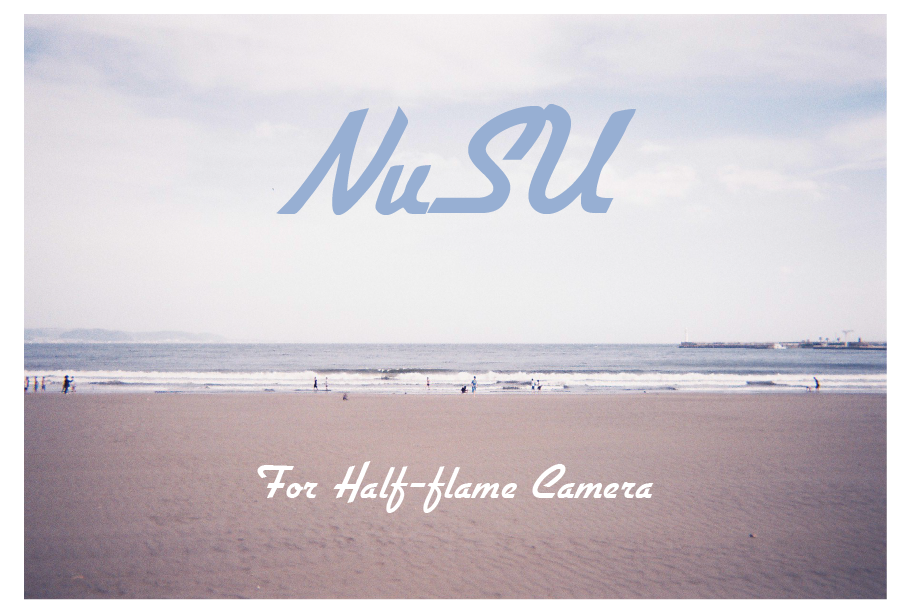

<h2>

</h2>

[日本語はこちら](./README-ja.md)

### About

NuSU is an image splitting software for half-frame cameras. It splits images developed in full-frame (36mm × 24mm) into half-size all at once.

### How to Use

#### 1. Download

Please download the latest version from [here](https://github.com/taikis/NuSU/releases).

#### 2. Launch

Place it in an appropriate folder and launch the app. No installation is required.

#### 3. Select Images

Please select images. You can select multiple images.

#### 4. Split Images

Press the "Cut & Save" button. The selected images will be saved in half-size in any folder.

### Development

#### Packaging

```sh
pip install -r requirements.txt
```

```sh
flet pack source/gui.py --icon 'assets/icon.png' --name NuSU --product-name NuSU --copyright 'Taiki Sugawara'
```